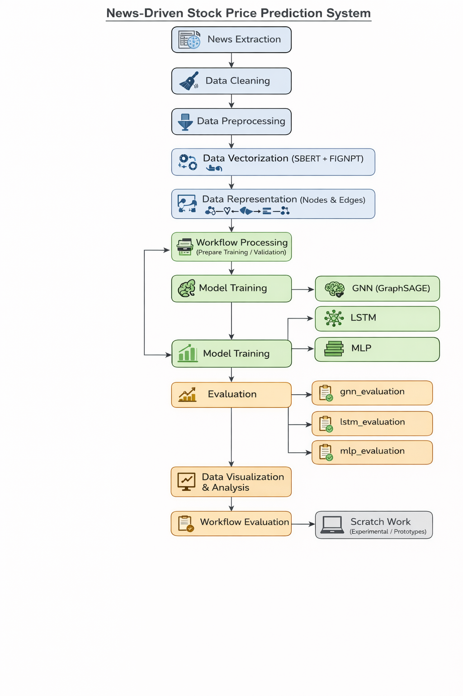

# News-Driven Stock Price Prediction with Graph Neural Networks (GNNs)

## Overview
This project implements a **news-driven Graph Neural Network (GNN)** pipeline to predict **stock prices** using financial news and historical market data.  
It combines **semantic embeddings**, **financial embeddings**, and **historical indicators** into a structured graph, capturing temporal and similarity relationships between trading days.  

The system is designed to demonstrate **research-grade ML modeling**, **modular engineering**, and **reproducible experiments**, making it suitable for academic, portfolio, and interview purposes.

---

## Problem Statement
Illiquid financial markets are influenced by both historical trends and real-time news. Traditional models often fail to capture complex interactions between news and stock prices.  

This project addresses this by:
- Structuring each day as a **node** with multiple features (news embeddings, price/volume indicators)  
- Connecting nodes via **temporal**, **similarity-based**, and **feature-based edges**  
- Using **GraphSAGE** and other models to predict closing stock prices

---

## Project Structure

| Folder | Description |
|--------|-------------|
| `news_extraction` | Collect and clean daily financial news data |
| `data_cleaning` | Raw data cleaning scripts (removing noise, duplicates, missing values) |
| `data_preprocessing` | Standardization, normalization, and preprocessing of price and feature data |
| `data_vectorization` | Conversion of news text into embeddings using SBERT and FinGPT |
| `data_representation` | Creation of node features and graph construction (temporal, similarity, feature-based edges) |
| `data_visualization` | Plots and visualizations for exploratory data analysis and result interpretation |
| `model_training` | Training scripts for GNN, MLP, and LSTM models |
| `gnn_evaluation` | Evaluation scripts and metrics for Graph Neural Network performance |
| `lstm_evaluation` | Evaluation scripts for LSTM-based models |
| `mlp_evaluation` | Evaluation scripts for MLP baseline models |
| `workflow_processing` | Orchestrates preprocessing, feature generation, and model input preparation |
| `workflow_evaluation` | Orchestrates model evaluation across different architectures |
| `scratch_work` | Experimental code and prototype scripts (non-production) |

---

## Graph Construction
- **Nodes**: Each trading day with concatenated embeddings and financial features  
- **Edges**:
  - **Temporal edges**: Connect consecutive days  
  - **Similarity-based edges**: High cosine similarity between SBERT or FinGPT embeddings  
  - **Feature-based edges**: Similar trends, moving averages, or volume indicators  

This results in a **heterogeneous graph** suitable for GraphSAGE modeling.

---

## Model Architecture
- **Graph Neural Network**: GraphSAGE  
- **Other Models**: LSTM and MLP baselines for comparison  
- **Input**: Node features (news embeddings + financial indicators)  
- **Output**: Predicted closing stock price  
- **Loss Function**: Mean Squared Error (MSE)  
- **Training Strategy**: Sliding window temporal batches

---

## Experiments & Evaluation
- **Training / Validation Split**: Chronologically partitioned historical data  
- **Hyperparameters**: Aggregation method, hidden layers, learning rate, dropout  
- **Metrics**: MSE, RMSE, R²  
- **Visualization**: Predicted vs actual prices, error distributions, feature importance

---

## Architecture Diagram

**Diagram Explanation**:  
1. **Nodes**: Daily stock + news embeddings  
2. **Edges**: Temporal + similarity + feature-based  
3. **GraphSAGE Layers**: Aggregates neighbor information for predictions  
4. **Output**: Closing price prediction  
5. Optional: Dockerized experiments and logging for reproducibility

---

## Key Highlights
- Modular Python code for **preprocessing, training, and evaluation**  
- **Reproducible experiments** using configuration files and deterministic seeds  
- Multiple architectures implemented for comparison: **GNN, LSTM, MLP**  
- Visual results for interpretable analysis  
- Potential for Dockerized reproducibility and deployment

---

## Tech Stack
- **Python**, **PyTorch**, **PyTorch Geometric**  
- **NumPy, Pandas, scikit-learn**  
- **Jupyter notebooks**  
- **Matplotlib / Seaborn** (visualizations)  
- **Docker** (optional for reproducibility)

---

## Project Status
 **Active research / modular prototype**  

- Fully implemented: data preprocessing, graph construction, GNN pipeline  
- Ongoing: evaluation, comparison with LSTM/MLP, reproducibility workflows  
- Optional future work: cloud deployment, extended financial features, more embeddings

---
## Ownership and Academic Disclaimer

This project is based on **my Master’s research work** submitted to the **University of Moratuwa** and approved by the University Senate.  
All code, experiments, and design are **authored by me**.

Please note:
- This work is intended for **portfolio, and educational purposes**.  
- Redistribution or commercial use is not permitted without explicit permission from the author.  
- The research will form the basis of **future publications** or academic work.
---

## Author
**Chamath Gamage**  
Backend Engineer | Python | Java | ML & NLP

